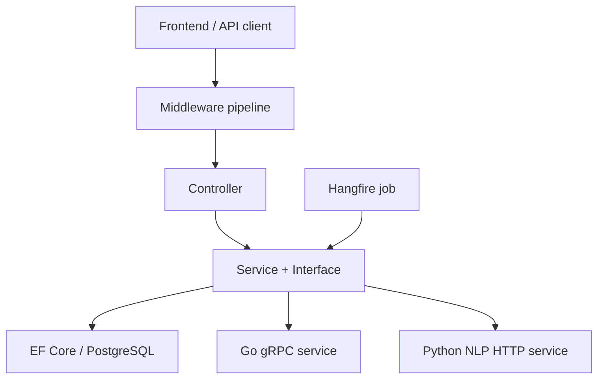

# Building the WalletApp .NET Backend from Scratch

> This is not a README. It is a project-specific tutorial for starting in an empty directory and rebuilding the current WalletApp backend, in a realistic development order.

## How to use this guide

If you forget the backend months from now, follow the document from beginning to end and implement each checkpoint before moving on. The guide explains both what to write and why that concern appears at that point in a real project.

Commit references map every feature to the real Git history. Code samples are shortened where that improves teaching; the current repository remains the final source of truth.

## 1. Mental model of the final system

The ASP.NET Core Web API is the center of the system. A request passes through middleware and a controller, then reaches a service. The service applies business rules, uses EF Core/PostgreSQL, or communicates with the Go and Python services.



| Directory | Responsibility |
| --- | --- |
| `Controllers/` | Routes, HTTP status codes, and request/response handling |
| `Services/` | Business rules, queries, and external-service communication |
| `Entities/` | Domain models mapped to PostgreSQL tables |
| `Dtos/` | Data contracts entering and leaving the API |
| `Data/` | `AppDbContext` and EF Core model configuration |
| `Middleware/` | Cross-cutting behavior around the request pipeline |
| `Filters/` | Behavior applied to selected controller actions |
| `Enums/` | Named finite value sets |
| `Protos/` | gRPC contract shared with the Go service |
| `Migrations/` | Versioned database-schema history |
| `WalletApp.Tests/` | Integration, concurrency, job, and E2E tests |

---

# Stage 1 — Create an empty Web API project

**Corresponding commits:** `281f4b2 Initial commit`, `80f2c44 Added Swagger and first controller`

Start with the smallest HTTP application before thinking about entities or microservices:

```bash
mkdir WalletApp
cd WalletApp
dotnet new webapi --use-controllers -n WalletApp
cd WalletApp
git init
dotnet run
```

The current project targets .NET 10:

```xml
<PropertyGroup>
  <TargetFramework>net10.0</TargetFramework>
  <Nullable>enable</Nullable>
  <ImplicitUsings>enable</ImplicitUsings>
</PropertyGroup>
```

```bash
mkdir Controllers Data Dtos Entities Enums Filters Middleware Services Protos
```

Initial controller:

```csharp
[ApiController]
[Route("api/[controller]")]
public class HealthController : ControllerBase
{
    [HttpGet]
    public IActionResult Get() => Ok(new { status = "healthy" });
}
```

Register controllers and Swagger in `Program.cs`, then call `app.MapControllers()`.

```csharp
builder.Services.AddControllers();
builder.Services.AddEndpointsApiExplorer();
builder.Services.AddSwaggerGen();

var app = builder.Build();
if (app.Environment.IsDevelopment())
{
    app.UseSwagger();
    app.UseSwaggerUI();
}

app.MapControllers();
app.Run();
```

At this point, resist the temptation to install every package you expect to use later. A running HTTP shell gives every later dependency a concrete reason to exist and makes failures easier to isolate.

**Checkpoint:** Swagger opens and `GET /api/health` returns 200.

---

# Stage 2 — Design the domain model and entities

**Corresponding commit:** `e98d372 Created Entities`

Define what the application stores before building all endpoints. `Transaction` is the central concept; other entities identify, categorize, or automate it.

## 2.1 BaseEntity

```csharp
public abstract class BaseEntity
{
    public Guid Id { get; set; } = Guid.NewGuid();
    public DateTime CreatedAt { get; set; } = DateTime.UtcNow;
}
```

GUIDs can be produced without a central sequence. UTC avoids behavior changing with the server timezone.

## 2.2 Master-data entities

- `Category`: name, icon, and optional parent category.
- `Merchant`: name and optional default category.
- `Currency`: code, symbol, and name.
- `Country`: name and code.
- `Tag`: name, color, and transaction relationships.
- `CategoryRule`: maps a keyword to a category.

```csharp
public class Category : BaseEntity
{
    public required string Name { get; set; }
    public string? Icon { get; set; }
    public Guid? ParentCategoryId { get; set; }
    public Category? ParentCategory { get; set; }
}

public class Merchant : BaseEntity
{
    public string Name { get; set; } = null!;
    public Guid? DefaultCategoryId { get; set; }
    public Category? DefaultCategory { get; set; }
}
```

The merchant's default category supports Quick Add classification.

## 2.3 Transaction and relationships

```csharp
public class Transaction : BaseEntity
{
    public DateTime TransactionDate { get; set; }
    public decimal Amount { get; set; }
    public decimal? ExchangeRate { get; set; }
    public string? Description { get; set; }

    public Guid CategoryId { get; set; }
    public Category Category { get; set; } = null!;
    public Guid? CurrencyId { get; set; }
    public Currency? Currency { get; set; }
    public Guid? MerchantId { get; set; }
    public Merchant? Merchant { get; set; }
    public Guid? CountryId { get; set; }
    public Country? Country { get; set; }
    public Guid UserId { get; set; }
    public User User { get; set; } = null!;

    public ICollection<TransactionTag> TransactionTags { get; set; } = [];
}
```

`CategoryId` is the foreign-key value; `Category` is the navigation property. Model the many-to-many Tag relationship explicitly:

```csharp
public class TransactionTag
{
    public Guid TransactionId { get; set; }
    public Transaction Transaction { get; set; } = null!;
    public Guid TagId { get; set; }
    public Tag Tag { get; set; } = null!;
}
```

## 2.4 User, recurring, and crypto models

Do not predict every future table on day one. Build them when the use case appears:

1. Core transactions and master data.
2. `User` when authentication is introduced.
3. `RecurringTransaction` when automated payments are needed.
4. `CryptoHolding` when portfolio tracking is added.

---

# Stage 3 — Connect EF Core and PostgreSQL

**Corresponding commits:** `060ea86 EF Core and DbContext`, later `18ed93e moved from Sqlite to PostgreSQL`, `c285187 Auto migration`

## 3.1 Packages

```bash
dotnet add package Microsoft.EntityFrameworkCore
dotnet add package Microsoft.EntityFrameworkCore.Design
dotnet add package Microsoft.EntityFrameworkCore.Relational
dotnet add package Npgsql.EntityFrameworkCore.PostgreSQL
dotnet tool install --global dotnet-ef
```

The early project experimented with SQLite; a fresh reconstruction can begin directly with PostgreSQL so types and concurrency behavior match production.

## 3.2 AppDbContext

```csharp
public class AppDbContext : DbContext
{
    public AppDbContext(DbContextOptions<AppDbContext> options) : base(options) { }

    public DbSet<Transaction> Transactions => Set<Transaction>();
    public DbSet<Category> Categories => Set<Category>();
    public DbSet<Currency> Currencies => Set<Currency>();
    public DbSet<Country> Countries => Set<Country>();
    public DbSet<Merchant> Merchants => Set<Merchant>();
    public DbSet<Tag> Tags => Set<Tag>();
    public DbSet<TransactionTag> TransactionTags => Set<TransactionTag>();
}
```

```csharp
builder.Services.AddDbContext<AppDbContext>(options =>
    options.UseNpgsql(builder.Configuration.GetConnectionString("DefaultConnection")));
```

Use user secrets or environment variables for the connection string. ASP.NET Core maps `ConnectionStrings__DefaultConnection` to `ConnectionStrings:DefaultConnection`.

## 3.3 Fluent configuration

```csharp
protected override void OnModelCreating(ModelBuilder modelBuilder)
{
    base.OnModelCreating(modelBuilder);

    modelBuilder.Entity<TransactionTag>()
        .HasKey(x => new { x.TransactionId, x.TagId });

    modelBuilder.Entity<Currency>()
        .HasIndex(x => x.Code)
        .IsUnique();

    modelBuilder.Entity<CryptoHolding>()
        .HasIndex(x => new { x.UserId, x.CoinCode })
        .IsUnique();
}
```

The composite key prevents adding the same tag twice. The crypto index guarantees one row per user and coin.

Explicit relationship configuration is also useful when conventions are not sufficiently obvious:

```csharp
modelBuilder.Entity<TransactionTag>()
    .HasOne(tt => tt.Transaction)
    .WithMany(t => t.TransactionTags)
    .HasForeignKey(tt => tt.TransactionId);

modelBuilder.Entity<TransactionTag>()
    .HasOne(tt => tt.Tag)
    .WithMany(t => t.TransactionTags)
    .HasForeignKey(tt => tt.TagId);
```

Database constraints are not merely performance hints. They protect invariants even if a future controller, background job, or migration bypasses the service-level checks.

## 3.4 Migration workflow

```bash
dotnet ef migrations add InitialPostgres
dotnet ef database update
```

After each schema change, create a meaningfully named migration and commit it. Do not delete migration history already applied to shared environments.

The current application calls `context.Database.Migrate()` at startup. That is convenient for a personal single-instance deployment. With multiple instances, run migrations as a separate deployment step to avoid races.

```csharp
using (var scope = app.Services.CreateScope())
{
    try
    {
        var context = scope.ServiceProvider.GetRequiredService<AppDbContext>();
        context.Database.Migrate();
    }
    catch (Exception ex)
    {
        var logger = scope.ServiceProvider.GetRequiredService<ILogger<Program>>();
        logger.LogError(ex, "An error occurred while migrating the database.");
    }
}
```

The `__EFMigrationsHistory` table records which migrations have already been applied. Treat it as shared deployment state, not as disposable generated data.

---

# Stage 4 — Build the first vertical feature: create and read transactions

**Corresponding commits:** `750338a`, `6225e3a`, `2f17124`, `29a0437`

Instead of generating every controller as a dummy, implement one complete path: request DTO → controller → EF Core → response DTO.

## 4.1 Why not expose entities directly?

Entities represent database storage; DTOs represent the public API contract. Separating them prevents over-posting, accidental data exposure, navigation cycles, and frontend breakage when the database model changes.

```csharp
public class CreateTransactionRequest
{
    public DateTime? Date { get; set; }
    public decimal Amount { get; set; }
    public string? Description { get; set; }
    public Guid? CategoryId { get; set; }
    public Guid? MerchantId { get; set; }
    public Guid? CurrencyId { get; set; }
    public Guid? CountryId { get; set; }
}
```

The response returns display values rather than entity graphs: category name/icon, merchant name, currency symbol, country, and username.

## 4.2 Start with a controller, extract a service when logic grows

The first version may briefly use `AppDbContext`. When defaults, validation, Quick Add, and caching expand the controller, introduce:

```csharp
public interface ITransactionService
{
    Task<PagedResult<TransactionResponse>> GetTransactionsAsync(TransactionQueryParameters query);
    Task<TransactionResponse> GetTransactionByIdAsync(Guid id);
    Task<TransactionResponse> CreateTransactionAsync(CreateTransactionRequest request);
    Task<TransactionResponse> QuickAddTransactionAsync(QuickAddRequest request);
    Task UpdateTransactionAsync(Guid id, UpdateTransactionRequest request);
    Task DeleteTransactionAsync(Guid id);
}
```

```csharp
builder.Services.AddScoped<ITransactionService, TransactionService>();
```

`Scoped` creates one service per HTTP request and matches `AppDbContext` lifetime.

The controller should handle HTTP; it should not contain classification, cache invalidation, exchange-rate selection, ownership, or large LINQ queries.

```csharp
[Authorize]
[ApiController]
[Route("api/[controller]")]
public class TransactionsController : ControllerBase
{
    private readonly ITransactionService _service;

    public TransactionsController(ITransactionService service)
        => _service = service;

    [HttpPost]
    public async Task<ActionResult<TransactionResponse>> Create(
        CreateTransactionRequest request)
    {
        var result = await _service.CreateTransactionAsync(request);
        return CreatedAtAction(nameof(GetById), new { id = result.Id }, result);
    }
}
```

`CreatedAtAction` produces HTTP 201 and a `Location` header pointing to the newly created resource. That is more expressive than returning a generic 200 for resource creation.

## 4.3 Validate relationships and project responses

Create flow:

1. Resolve the current user.
2. Validate or choose default Category/Currency/Country/Merchant IDs.
3. Create the entity.
4. Call `SaveChangesAsync`.
5. Return a response DTO.

For reads, use `AsNoTracking()` and `Select` projection so SQL retrieves only required fields. Always filter user-owned data by both resource ID and current user ID.

```csharp
var response = await _context.Transactions
    .AsNoTracking()
    .Where(t => t.Id == id && t.UserId == userId)
    .Select(t => new TransactionResponse
    {
        Id = t.Id,
        Date = t.TransactionDate,
        Amount = t.Amount,
        Description = t.Description,
        CategoryName = t.Category.Name,
        MerchantName = t.Merchant != null ? t.Merchant.Name : null,
        CurrencySymbol = t.Currency != null ? t.Currency.Symbol : string.Empty,
        CountryName = t.Country != null ? t.Country.Name : string.Empty,
        AddedBy = t.User.Username
    })
    .SingleOrDefaultAsync();
```

Projection lets EF translate navigation access into SQL joins without loading the entire entity graph. `AsNoTracking` removes change-tracker overhead for read-only results.

---

# Stage 5 — Filtering, ordering, and pagination

**Corresponding commits:** `e2daa8f Filter & Pagination`, `1a628ea UTC normalization`

```csharp
public class TransactionQueryParameters
{
    public Guid? CategoryId { get; set; }
    public Guid? MerchantId { get; set; }
    public DateTime? StartDate { get; set; }
    public DateTime? EndDate { get; set; }
    public Guid? CountryId { get; set; }
    public Guid? CurrencyId { get; set; }
    public int PageNumber { get; set; } = 1;

    private int _pageSize = 10;
    public int PageSize
    {
        get => _pageSize;
        set => _pageSize = value > 50 ? 50 : value;
    }
}
```

Compose the `IQueryable`: ownership filter first, optional filters, `CountAsync`, ordering, then `Skip/Take`, and finally DTO projection. Normalize incoming times to UTC; Npgsql can reject `DateTimeKind.Unspecified` against `timestamptz`.

```csharp
var queryable = _context.Transactions
    .AsNoTracking()
    .Where(t => t.UserId == currentUserId);

if (query.CategoryId.HasValue)
    queryable = queryable.Where(t => t.CategoryId == query.CategoryId.Value);

if (query.MerchantId.HasValue)
    queryable = queryable.Where(t => t.MerchantId == query.MerchantId.Value);

if (query.StartDate.HasValue)
    queryable = queryable.Where(t =>
        t.TransactionDate >= query.StartDate.Value.ToUniversalTime());

var totalCount = await queryable.CountAsync();
var items = await queryable
    .OrderByDescending(t => t.TransactionDate)
    .Skip((query.PageNumber - 1) * query.PageSize)
    .Take(query.PageSize)
    .Select(/* TransactionResponse projection */)
    .ToListAsync();
```

Apply filters before counting so `TotalCount` describes the filtered result. Apply ordering before `Skip/Take`; pagination without deterministic ordering can return unstable pages.

---

# Stage 6 — MasterDataService, caching, and invalidation

**Corresponding commits:** `291bb6c`, `68343a8`, `f3387d9`, `69c536d`, `74c1013`, `41e7d9a`

Categories, currencies, countries, and merchants are read frequently and changed rarely. Collect their behavior under `IMasterDataService`.

```csharp
public interface IMasterDataService
{
    Task<IEnumerable<CategoryResponseDto>> GetCategoriesAsync();
    Task<CategoryResponseDto> GetCategoryByIdAsync(Guid id);
    Task<Category> CreateCategoryAsync(Category category);
    Task<Category> UpdateCategoryAsync(Guid id, Category category);
    Task DeleteCategoryAsync(Guid id);

    // Equivalent currency, country, and merchant methods...
}
```

Cache-aside flow:

1. Look up the cache key.
2. Deserialize and return on a hit.
3. Query PostgreSQL on a miss.
4. Serialize and cache with expiration.
5. Remove affected keys after create/update/delete.

```csharp
var cached = await _cache.GetStringAsync("categories_all");
if (cached is not null)
    return JsonSerializer.Deserialize<List<CategoryResponseDto>>(cached)!;

var categories = await _context.Categories.AsNoTracking()
    .Select(/* DTO projection */)
    .ToListAsync();
```

The current registration is `AddDistributedMemoryCache()`. The abstraction is `IDistributedCache`, but the provider is process-local memory—not Redis. Entries disappear on restart and are not shared across instances. Redis can later replace the provider without changing business services.

Never forget invalidation after mutations; otherwise the API serves stale master data.

Use consistent key names and expiration policies. A small generic helper can remove serialization repetition, but do not hide which business mutations invalidate which keys. Cache invalidation is a business consistency rule, not only an infrastructure detail.

---

# Stage 7 — Quick Add and the database-driven category-rule engine

**Corresponding commits:** `039640b`, `3e20ad8`, fixes `a27e9a9`/`49ed60c`, DB move `4f3b740`

Quick Add parses text such as `1500 starbucks coffee`:

1. Extract the decimal amount.
2. Match cached merchant names.
3. Use `Merchant.DefaultCategoryId` when available.
4. Otherwise match keyword/category rules.
5. Fall back to `Other`.
6. Reuse the normal transaction-create flow.

Rules began in JSON. When they needed to change without code deployment, they moved to the `CategoryRule` table and cache. Keep algorithms in code; move frequently changing business data into storage.

---

# Stage 8 — Dashboard and aggregation queries

**Corresponding commits:** `88d7a2f`, `872f8a3`, `7cb2b12`, `3a3473f`

Dashboard is reporting over transactions, not separate CRUD. `DashboardService`:

1. Calculates UTC month boundaries.
2. Applies current-user, optional user, and currency filters.
3. Calculates total expense.
4. Groups by category and merchant.
5. Produces daily trends.
6. Includes recent transactions.

The controller only supplies default year/month values and delegates.

---

# Stage 9 — Global exception handling and structured logging

**Corresponding commits:** `a539a34 global exception middleware`, `9f2f5b2 Serilog`

Do not repeat `try/catch` in every controller. Services throw meaningful exceptions; middleware maps them to HTTP.

| Exception | HTTP |
| --- | --- |
| `ArgumentException` | 400 |
| `KeyNotFoundException` | 404 |
| `UnauthorizedAccessException` | 401 |
| `DbUpdateConcurrencyException` | 409 |
| `RpcException` | 503 |
| `HttpRequestException` | 502 |
| Other | 500 |

Return a consistent `ErrorResponse`; expose stack traces only in development.

```csharp
public class ErrorResponse
{
    public int StatusCode { get; set; }
    public string Message { get; set; } = string.Empty;
    public string? Details { get; set; }
}
```

The middleware should log the full exception once, then return a safe message. Avoid logging the same exception in every controller and again in middleware, because duplicate error events make incident analysis noisy.

```csharp
Log.Logger = new LoggerConfiguration()
    .MinimumLevel.Information()
    .Enrich.FromLogContext()
    .WriteTo.Console()
    .WriteTo.File(new CompactJsonFormatter(), "Logs/walletapp-log-.json",
        rollingInterval: RollingInterval.Day)
    .CreateLogger();
```

Middleware order matters: exception middleware must wrap the components whose exceptions it should catch.

---

# Stage 10 — JWT authentication, current user, and authorization

**Corresponding commits:** `445fd20`, `bdeccb3`, `29ee549`, `e967c30`, `c027ee8`, `d94ceb3`, `052e585`, `7d580a7`, `8fa2f9c`, `ea855a2`

## 10.1 User and password hashing

```csharp
public class User : BaseEntity
{
    public string Username { get; set; } = string.Empty;
    public string PasswordHash { get; set; } = string.Empty;
    public string Role { get; set; } = "User";
}
```

Use BCrypt; never store plaintext passwords.

```csharp
var hash = BCrypt.Net.BCrypt.HashPassword(request.Password);
var valid = BCrypt.Net.BCrypt.Verify(request.Password, user.PasswordHash);
```

## 10.2 JWT generation

Include user ID (`NameIdentifier`/subject), username, role, unique `Jti`, and expiration. Keep the signing key in user secrets or deployment environment variables, never as a real repository value.

## 10.3 JWT validation

Configure issuer, audience, lifetime, signature, and signing key in `AddJwtBearer`. In the pipeline, `UseAuthentication()` must precede `UseAuthorization()`.

```csharp
builder.Services.AddAuthentication(options =>
{
    options.DefaultAuthenticateScheme = JwtBearerDefaults.AuthenticationScheme;
    options.DefaultChallengeScheme = JwtBearerDefaults.AuthenticationScheme;
})
.AddJwtBearer(options =>
{
    var secret = builder.Configuration["JwtSettings:SecretKey"]!;
    options.TokenValidationParameters = new TokenValidationParameters
    {
        ValidateIssuer = true,
        ValidateAudience = true,
        ValidateLifetime = true,
        ValidateIssuerSigningKey = true,
        ValidIssuer = builder.Configuration["JwtSettings:Issuer"],
        ValidAudience = builder.Configuration["JwtSettings:Audience"],
        IssuerSigningKey = new SymmetricSecurityKey(Encoding.UTF8.GetBytes(secret))
    };
});
```

Initialize a strong local key without committing it:

```bash
dotnet user-secrets init
dotnet user-secrets set "JwtSettings:SecretKey" "a-long-random-development-secret"
```

JWTs are signed, not necessarily encrypted. Never put passwords or sensitive financial data into claims merely because the token is signed.

### Swagger authentication during development

Swagger can expose a Bearer input so protected endpoints remain easy to test without weakening authorization:

```csharp
builder.Services.AddSwaggerGen(options =>
{
    options.SwaggerDoc("v1", new OpenApiInfo
    {
        Title = "WalletApp",
        Version = "v1"
    });

    options.AddSecurityDefinition("Bearer", new OpenApiSecurityScheme
    {
        Description = "JWT Authorization header: Bearer {token}",
        Name = "Authorization",
        In = ParameterLocation.Header,
        Type = SecuritySchemeType.Http,
        Scheme = "bearer",
        BearerFormat = "JWT"
    });

    options.AddSecurityRequirement(document => new()
    {
        [new OpenApiSecuritySchemeReference("Bearer", document)] = []
    });
});
```

Swagger is a development interface, not a security boundary. Production exposure should be a deliberate operational choice.

## 10.4 CurrentUserService and ownership

Never trust a client-supplied `UserId`. Register `IHttpContextAccessor`, read the verified claim in `CurrentUserService`, and filter every user resource by ownership. Update/delete must search by `Id && UserId`, not only `Id`.

## 10.5 Token blacklist

After password change or account deletion, add the token's `Jti` to cache until its expiration and check it in `OnTokenValidated`. Because the current provider is memory cache, revocation disappears after restart and is not shared between instances. Redis or persistent storage is required at larger scale.

## 10.6 Authorization

- `[Authorize]`: authenticated users.
- `[Authorize(Roles = "Admin")]`: Admin role claim.
- Registration can be disabled through `AllowRegistration` configuration.
- Destructive seed/delete operations may require both role authorization and explicit confirmation text.

### Admin seed operations

The project contains admin endpoints for seeding core currencies, countries, categories, merchants, tags, and category rules. Treat them as deployment or controlled administrative operations rather than ordinary user-facing CRUD.

A safe seed endpoint should:

1. Require authenticated Admin authorization.
2. Require explicit confirmation for destructive overwrite.
3. Detect an already populated database.
4. Avoid deleting financial transactions while replacing master data.
5. Keep private seed data outside Git.
6. Be repeatable or clearly reject a second run.

Confirmation text such as `DELETE_APPROVE` is an additional guard against accidental clicks, not a substitute for role-based authorization. For mature deployments, prefer a migration/seed command or a short-lived administrative job over a permanently exposed endpoint.

---

# Stage 11 — CORS and frontend integration

**Corresponding commits:** `d0487d1`, `1668cae`, `0cc7e26`, `1ff302e`

Load allowed origins from configuration rather than hardcoding them. With credentials, use explicit origins; `AllowCredentials()` cannot be combined with `AllowAnyOrigin()`. Production should list only the real frontend origins.

```csharp
var origins = builder.Configuration["AllowedOrigins"]?
    .Split(',', StringSplitOptions.RemoveEmptyEntries)
    ?? ["http://localhost:5173"];

builder.Services.AddCors(options =>
{
    options.AddPolicy("AllowFrontend", policy => policy
        .WithOrigins(origins)
        .AllowAnyHeader()
        .AllowAnyMethod()
        .AllowCredentials());
});

app.UseCors("AllowFrontend");
```

---

# Stage 12 — Update/delete safety and optimistic concurrency

**Corresponding commits:** `2cc653b`, `c1696c9`, `7801f79`, `3c22853`, `62a2a02`, `3ca3418`

## 12.1 Update approach

The current nullable update DTO behaves like partial update:

```csharp
if (request.Amount.HasValue) transaction.Amount = request.Amount.Value;
if (request.Date.HasValue) transaction.TransactionDate = request.Date.Value.ToUniversalTime();
if (request.Description is not null) transaction.Description = request.Description;
```

That behavior is closer to HTTP PATCH than PUT. In a redesign, either require a complete resource for PUT or name partial updates PATCH.

Before deleting master data, inspect relationships. Silent cascade deletion can destroy financial records.

## 12.2 PostgreSQL `xmin` concurrency control

Without concurrency control, two devices can read one transaction, save independently, and the later write silently overwrites the earlier change. PostgreSQL's hidden `xmin` system column changes when a row version changes.

```csharp
modelBuilder.Entity<Transaction>()
    .Property<uint>("Version")
    .HasColumnName("xmin")
    .HasColumnType("xid")
    .IsRowVersion()
    .ValueGeneratedOnAddOrUpdate();
```

EF tracks the original value and includes it in the update condition. If another context changed the row, zero rows are affected and EF throws `DbUpdateConcurrencyException`, which middleware maps to 409 Conflict.

Important nuance: if the API re-reads the entity immediately before every update and the client does not send its original version, stale state across separate HTTP requests may not be fully detected. Strong HTTP concurrency exposes the version/ETag to the client and requires it through `If-Match` or a version field.

---

# Stage 13 — Idempotency

**Corresponding commit:** `cb1abde Idempotency Filter as Controller Attribute`

Idempotency prevents a retried create request from writing twice. The client sends one UUID per logical operation:

```http
X-Idempotency-Key: 9f39d8f1-...
```

The action filter validates the header, checks `Idempotency_{key}`, returns a cached successful response when present, otherwise executes the action and stores its result for 24 hours.

```csharp
[HttpPost]
[Idempotency]
public async Task<IActionResult> CreateTransaction(
    CreateTransactionRequest request)
{
    var result = await _transactionService.CreateTransactionAsync(request);
    return Ok(result);
}
```

Conceptually, the filter performs:

```csharp
var cached = await cache.GetStringAsync(cacheKey);
if (cached is not null)
{
    context.Result = new OkObjectResult(JsonSerializer.Deserialize<object>(cached));
    return;
}

var executed = await next();
if (executed.Exception is null && executed.Result is ObjectResult result)
{
    await cache.SetStringAsync(
        cacheKey,
        JsonSerializer.Serialize(result.Value),
        new DistributedCacheEntryOptions
        {
            AbsoluteExpirationRelativeToNow = TimeSpan.FromHours(24)
        });
}
```

Scope keys by user, method, and route: `idem:{userId}:{method}:{path}:{key}`.

Current limitations:

- Memory entries disappear on restart.
- Two simultaneous first requests can both see a miss and continue.
- Full status code/headers are not preserved.
- Reusing a key with a different request body is not detected.

For production, use an atomic PostgreSQL unique record or Redis `SET NX`, store request hash/status/body, and preserve a database constraint or transaction as the final defense against duplicate financial writes.

An idempotency record normally needs these fields:

| Field | Purpose |
| --- | --- |
| User/tenant | Prevents cross-user key collisions |
| Method + route | Prevents reuse across unrelated operations |
| Idempotency key | Identifies the logical client command |
| Request hash | Rejects the same key with different content |
| State | Processing, completed, or failed |
| Status/body | Replays the original result accurately |
| Expiration | Allows controlled cleanup |

The database write and idempotency completion should be coordinated. Otherwise a crash can leave the business row committed while the idempotency record still appears absent.

---

# Stage 14 — Recurring transactions and Hangfire

**Corresponding commits:** `54ee7f0`, `464fbd6`, `742295f`, `0f43b0f`, `983ee47`, `d33d0aa`

Model the recurring domain before adding the scheduler. Store frequency, next execution, active state, ownership, and optional installment totals/progress.

```csharp
public class RecurringTransaction : BaseEntity
{
    public string Name { get; set; } = string.Empty;
    public string? Description { get; set; }
    public decimal Amount { get; set; }

    public Guid CategoryId { get; set; }
    public Category Category { get; set; } = null!;
    public Guid? MerchantId { get; set; }
    public Merchant? Merchant { get; set; }
    public Guid UserId { get; set; }
    public User User { get; set; } = null!;

    public RecurringFrequency Frequency { get; set; }
    public DateTime NextExecutionDate { get; set; }
    public bool IsActive { get; set; } = true;
    public bool IsInstallment { get; set; }
    public int? TotalInstallments { get; set; }
    public int? ProcessedInstallments { get; set; } = 0;
}
```

Create the entity and migration before installing Hangfire. The scheduler is infrastructure; the recurring-payment state and rules belong to the domain and must remain testable without a running scheduler.

## 14.1 Hangfire setup

```bash
dotnet add package Hangfire.AspNetCore
dotnet add package Hangfire.PostgreSql
```

Register PostgreSQL storage, Hangfire server, and `ISubscriptionJobService`. Schedule:

```csharp
builder.Services.AddHangfire(config => config
    .SetDataCompatibilityLevel(CompatibilityLevel.Version_180)
    .UseSimpleAssemblyNameTypeSerializer()
    .UseRecommendedSerializerSettings()
    .UsePostgreSqlStorage(options =>
        options.UseNpgsqlConnection(connectionString)));

builder.Services.AddHangfireServer();
builder.Services.AddScoped<ISubscriptionJobService, SubscriptionJobService>();
```

```csharp
RecurringJob.AddOrUpdate<ISubscriptionJobService>(
    "Subscription_Expense_Task",
    service => service.ProcessRecurringTransactionAsync(),
    Cron.Daily(1));
```

## 14.2 Job business flow

1. Find active rows due at or before `UtcNow`.
2. Create a real `Transaction` for each.
3. Increment installment progress when applicable.
4. Disable the final installment.
5. Otherwise advance the date by frequency.
6. Persist the unit atomically.

The job itself should be idempotent. If a worker writes the transaction and crashes before advancing the recurring row, retry can duplicate it. A unique `(RecurringTransactionId, ScheduledExecutionDate)` execution ledger prevents that. Protect the Hangfire dashboard in production.

---

# Stage 15 — Go gRPC service: exchange and crypto rates

**Corresponding commits:** `e34d515 HTTP integration`, `3436958 gRPC refactor`, `9912423 crypto portfolio`, `99e7b41 bulk insert + gRPC`

The integration began as HTTP and later moved to typed gRPC. Install protobuf/gRPC packages, generate the client from `Protos/rate.proto`, and register it with `AddGrpcClient`.

```csharp
builder.Services.AddGrpcClient<
    WalletApp.Protos.ExchangeRateService.ExchangeRateServiceClient>(options =>
{
    var grpcUrl = builder.Configuration["GoGrpcServiceUrl"]
        ?? "http://localhost:50051";
    options.Address = new Uri(grpcUrl);
});
```

The `.csproj` marks the contract as a client source:

```xml
<Protobuf Include="Protos\rate.proto" GrpcServices="Client" />
```

Wrap the generated client in `ExchangeRateService` so transaction logic does not depend directly on protobuf details.

Crypto flow:

1. Load the user's holdings.
2. Create one price task per coin.
3. Await independent I/O with `Task.WhenAll`.
4. Calculate `Amount * CurrentPrice`.
5. Return the USD portfolio total.

Add cancellation, timeouts, and a clear partial-failure policy.

---

# Stage 16 — Call the Python NLP service through the .NET gateway

**Corresponding commits:** `bee7371 NLP gateway`, `8519d36 correlation forwarding`

The browser sends the statement to `.NET /api/transactions/parse-statement`, not directly to Python.

Gateway flow:

1. Validate non-empty file.
2. Enforce 5 MB.
3. Check allowed MIME types and ideally magic bytes.
4. Attach cached categories and merchants.
5. Send multipart data through `IHttpClientFactory`.
6. Add the internal API secret.
7. Return the Python result.

Keep parsing and database insertion separate: show candidates to the user first, then perform an idempotent bulk insert after confirmation.

Use `IHttpClientFactory` rather than constructing `new HttpClient()` repeatedly. The factory manages handler and connection reuse and gives one place for timeouts or policies. Forward only the master data Python needs; never expose the DeepSeek key to the frontend.

---

# Stage 17 — Correlation ID and OpenTelemetry

**Corresponding commits:** `6a8ff22`, `8519d36`, `784b60e`

## 17.1 Correlation middleware

Preserve incoming `X-Correlation-ID` or generate a GUID, include it in the response, and push it into Serilog `LogContext`. Forward the same value to Python HTTP headers and Go gRPC metadata.

## 17.2 OpenTelemetry

Instrument incoming ASP.NET Core requests, outgoing HttpClient calls, gRPC clients, and EF Core queries. Export through OTLP with service name `FamilyFinance.Backend`.

```csharp
builder.Services.AddOpenTelemetry()
    .WithTracing(tracing => tracing
        .SetResourceBuilder(ResourceBuilder.CreateDefault()
            .AddService("FamilyFinance.Backend"))
        .AddAspNetCoreInstrumentation()
        .AddHttpClientInstrumentation()
        .AddGrpcClientInstrumentation()
        .AddEntityFrameworkCoreInstrumentation()
        .AddOtlpExporter(options =>
        {
            options.Endpoint = new Uri(
                builder.Configuration["OTLP_ENDPOINT"]
                ?? "http://localhost:4317");
        }));
```

Correlation IDs support application-level log searching; trace/span IDs model the standard distributed call tree. They complement each other.

---

# Stage 18 — Docker and local environment

**Corresponding commits:** `616f86d WIP`, `18ed93e Dockerized with PostgreSQL`

Use a multi-stage Dockerfile: SDK image restores/builds/publishes; the final ASP.NET runtime image contains only published output.

```dockerfile
FROM mcr.microsoft.com/dotnet/aspnet:10.0 AS base
WORKDIR /app
EXPOSE 8080

FROM mcr.microsoft.com/dotnet/sdk:10.0 AS build
WORKDIR /src
COPY ["WalletApp.csproj", "./"]
RUN dotnet restore "WalletApp.csproj"
COPY . .
RUN dotnet publish "WalletApp.csproj" -c Release -o /app/publish

FROM base AS final
WORKDIR /app
COPY --from=build /app/publish .
ENTRYPOINT ["dotnet", "WalletApp.dll"]
```

In Compose, PostgreSQL gets a health check and persistent volume. The API connection host is the service name `postgres-db`, not `localhost`, because container localhost refers to the API container itself.

Never commit production passwords. Be careful with `docker compose down -v`: it deletes the database volume.

---

# Stage 19 — Test project, Testcontainers, and real scenarios

**Corresponding commits:** `db74617`, `3ca3418`, `d33d0aa`, `a135f82`, then stabilization `b417385`, `91f648d`, `23ad2c3`, `5f55821`, `b9025c6`

## 19.1 Create the test project

```bash
dotnet new xunit -n WalletApp.Tests
dotnet add WalletApp.Tests reference WalletApp.csproj
dotnet add WalletApp.Tests package Microsoft.AspNetCore.Mvc.Testing
dotnet add WalletApp.Tests package Testcontainers.PostgreSql
dotnet add WalletApp.Tests package FluentAssertions
dotnet add WalletApp.Tests package Microsoft.EntityFrameworkCore
dotnet add WalletApp.Tests package coverlet.collector
```

Expose `public partial class Program { }` for the test factory.

## 19.2 CustomWebApplicationFactory

The factory starts a PostgreSQL container, replaces the production DbContext registration, overrides registration/JWT test configuration, and shuts down ASP.NET/Hangfire before disposing the container. Tests never touch the developer's WalletDb.

The lifecycle is roughly:

1. Allocate a random PostgreSQL container and dynamic host port.
2. Start it before constructing the application client.
3. Remove the production `DbContextOptions<AppDbContext>` registration.
4. Register the container connection string.
5. Override `AllowRegistration` and supply a valid-length JWT secret.
6. Apply migrations to the isolated database.
7. Create an `HttpClient` backed by the in-memory test host.
8. Dispose the ASP.NET host and Hangfire server first.
9. Stop and dispose PostgreSQL last.

That order matters. If the database disappears while the host or Hangfire worker is still running, background connections can hang or produce race conditions during teardown.

## 19.3 Test layers

| Test | Proves |
| --- | --- |
| Database integration | EF mapping, migrations, and PostgreSQL behavior |
| Concurrency integration | Two DbContexts cannot silently overwrite stale `xmin` state |
| Subscription job | A due recurring row becomes a transaction and advances |
| User journey E2E | Register → JWT → seed/data → transaction → dashboard |

E2E calls real endpoints and supplies Bearer JWT plus `X-Idempotency-Key` for creates.

The E2E journey should assert behavior, not internal methods. A representative flow is:

1. Register a user in the test-only configuration.
2. Log in and capture the JWT.
3. Seed or create the minimum master data.
4. Create a transaction with an idempotency key.
5. Repeat the request and verify it does not create a duplicate.
6. Query the transaction list.
7. Query the dashboard and verify its aggregation includes the transaction.

This single journey exercises routing, authentication, DTO binding, service logic, EF mappings, PostgreSQL behavior, caching assumptions, and response contracts together.

## 19.4 Parallelism issue

Hangfire/global ports and container lifecycle caused conflicts, so xUnit parallelization was disabled. This is a practical stabilization; isolated dynamic resources can later restore parallel execution.

---

# Stage 20 — CI/CD

**Corresponding commits:** `58a727d GitHub Actions`, `70c2514 paths-ignore`

Pipeline order:

1. Checkout.
2. Install .NET 10.
3. Restore.
4. Release build.
5. Testcontainers-backed tests.
6. Only after success, call the protected Coolify deploy webhook.

Store webhook credentials as repository secrets. Ignore documentation-only paths when a full pipeline is unnecessary.

```yaml
name: CI/CD
on:
  push:
    branches: [main]
    paths-ignore:
      - "**/*.md"
      - "docs/**"

jobs:
  test-and-deploy:
    runs-on: ubuntu-latest
    steps:
      - uses: actions/checkout@v4
      - uses: actions/setup-dotnet@v4
        with:
          dotnet-version: "10.0.x"
      - run: dotnet restore
      - run: dotnet build --no-restore --configuration Release
      - run: dotnet test --no-build --configuration Release
      - name: Deploy
        if: success()
        run: curl --fail -X POST "${{ secrets.COOLIFY_WEBHOOK }}"
```

The deployment step is a consequence of passing the quality gate, not a parallel concern. A failing migration, concurrency test, or E2E user journey must stop the release.

---

# Stage 21 — Assemble `Program.cs` in the right order

### Configuration inventory

Keep configuration names consistent across local settings, Docker Compose, Coolify, tests, and documentation:

| Configuration | Purpose |
| --- | --- |
| `ConnectionStrings:DefaultConnection` | PostgreSQL connection |
| `JwtSettings:SecretKey` | JWT signing key |
| `JwtSettings:Issuer` / `Audience` | Token validation boundaries |
| `JwtSettings:ExpirationMinutes` | Token lifetime |
| `AllowedOrigins` | Comma-separated frontend origins |
| `AllowRegistration` | Controls public registration |
| `GoGrpcServiceUrl` | Internal Go gRPC address |
| `NLP_SERVICE_URL` | Internal Python HTTP address |
| `NLP_API_SECRET` | Shared .NET-to-Python secret |
| `OTLP_ENDPOINT` | OpenTelemetry collector endpoint |

Environment variables represent nested keys with double underscores, for example `JwtSettings__SecretKey`. Validate mandatory production settings at startup rather than discovering a missing secret during the first real request.

## Logical service-registration order

1. Serilog.
2. DbContext.
3. Authentication/authorization.
4. Hangfire.
5. OpenTelemetry.
6. Controllers and JSON options.
7. Cache and HttpClient.
8. Application interfaces/services.
9. gRPC typed client.
10. Swagger.
11. CORS.

## Pipeline order

```csharp
app.UseMiddleware<CorrelationIdMiddleware>();
app.UseMiddleware<ExceptionMiddleware>();
app.UseHttpsRedirection();
app.UseCors("AllowFrontend");
app.UseAuthentication();
app.UseAuthorization();
app.UseHangfireDashboard(); // protect in production
app.MapControllers();
app.Run();

public partial class Program { }
```

Middleware executes as nested wrappers. Correlation should cover the whole request, exception middleware must wrap controller/service execution, and authentication precedes authorization.

Development-only Swagger belongs after the app is built and before endpoint mapping. CORS must run before the endpoint is executed. If rate limiting, response compression, or forwarded headers are added later, revisit the entire pipeline order instead of appending middleware blindly.

---

# Stage 22 — Endpoint and feature inventory

| Feature | Controller | Main service | Entity/DTO |
| --- | --- | --- | --- |
| Authentication/users | `AuthController` | `AuthService` | `User`, auth DTOs |
| Transaction CRUD/search | `TransactionsController` | `TransactionService` | Transaction DTOs |
| Quick Add | `TransactionsController` | `TransactionService` | `QuickAddRequest`, rules, merchants |
| Bulk import/NLP | `TransactionsController` | `TransactionService` | Transaction DTOs + Python payload |
| Master data | Related controllers | `MasterDataService` | Master entities/DTOs |
| Tags | `TagsController` | Currently DbContext | `Tag`, `TransactionTag` |
| Dashboard | `DashboardController` | `DashboardService` | Dashboard DTOs |
| Recurring CRUD | `RecurringTransactionsController` | `RecurringTransactionService` | Recurring models |
| Recurring execution | Hangfire | `SubscriptionJobService` | Recurring + Transaction |
| Crypto | `CryptoController` | `CryptoService` | CryptoHolding/DTOs |
| Exchange rate | Indirect | `ExchangeRateService` | Generated proto types |
| Seed/admin | `AdminController` | MasterDataService + DbContext | Admin/master data |

Some simple Tags/Admin operations still use DbContext directly. Move them when business logic grows; do not enforce abstraction only for appearance.

---

# Stage 23 — End-to-end reconstruction checklist

## Core foundation

- [ ] Web API, Swagger, folders, entities, EF Core, Npgsql, DbContext, and initial migration work.
- [ ] Transaction request/response DTOs and first vertical create/read flow work.
- [ ] Service interfaces are registered with correct lifetimes.

## First usable product

- [ ] Filtering, pagination, UTC normalization, master-data caching, and invalidation work.
- [ ] Quick Add, category rules, and dashboard aggregations work.

## Security and reliability

- [ ] Global errors and structured logs are consistent.
- [ ] BCrypt, JWT validation, CurrentUser ownership, role authorization, and registration control work.
- [ ] CORS comes from environment configuration.
- [ ] `xmin` concurrency and integration tests work.
- [ ] Critical create endpoints enforce idempotency.

## Automation and services

- [ ] Recurring CRUD, Hangfire storage/job, and protected dashboard work.
- [ ] Go gRPC client and Python gateway are configured with timeouts and correlation propagation.
- [ ] OpenTelemetry exports distributed traces.

## Delivery and quality

- [ ] Multi-stage Docker and Compose health checks work.
- [ ] Secrets are not committed.
- [ ] Testcontainers DB, concurrency, job, and E2E tests pass.
- [ ] CI blocks deployment after failure.
- [ ] Production migration and rollback policy is defined.

---

# Stage 24 — Short glossary

**Entity:** Domain object persisted in the database.  
**DTO:** Contract crossing the API boundary.  
**DbContext:** EF Core session, change tracker, and unit-of-work center.  
**Migration:** Versioned database-schema change.  
**Navigation property:** C# object referenced by a foreign key.  
**Projection:** Producing only required response fields with `Select`.  
**Dependency Injection:** Receiving dependencies rather than constructing them internally.  
**Scoped:** One instance per HTTP request.  
**Middleware:** Component wrapping broad request-pipeline behavior.  
**Action filter:** Behavior around selected MVC actions.  
**Cache-aside:** Check cache, load from DB on miss, then cache.  
**Invalidation:** Removing stale cache entries after data changes.  
**JWT/JTI:** Signed claim token and its unique token identifier.  
**Idempotency:** Repeating one logical command produces one effect.  
**Optimistic concurrency:** Verify version during write rather than locking early.  
**`xmin`:** PostgreSQL system transaction identifier used as row version.  
**gRPC:** Typed RPC based on Protobuf contracts.  
**Hangfire:** Persistent background-job and recurring scheduler framework.  
**Correlation ID:** Application identifier following one request across services.  
**Trace/span:** OpenTelemetry distributed-operation model.  
**Testcontainer:** Temporary real dependency container used during tests.

---

# Stage 25 — Improvements intentionally left for later

1. Replace memory `IDistributedCache` with Redis for shared cache, blacklist, and idempotency.
2. Make idempotency atomic and persist request hash/status/body.
3. Expose version/ETag for HTTP concurrency.
4. Protect Hangfire dashboard authorization.
5. Add a unique recurring execution ledger.
6. Systematize validation with DataAnnotations or FluentValidation.
7. Pass `CancellationToken` through EF/gRPC/HTTP calls.
8. Add careful timeout/retry/circuit-breaker policy; never blindly retry create commands.
9. Move migrations to a release job for multi-instance production.
10. Add liveness and dependency-aware readiness checks.
11. Separate API and Hangfire worker when scaling requires it.
12. Add centralized secret management and rotation.

---

# Appendix A — The project's real development phases

1. Application shell: project, Swagger, first controller.
2. Data model: entities, DbContext, first migration.
3. Core finance: transactions, tags, dashboard, Quick Add.
4. Layering: services/interfaces and thin controllers.
5. Operational foundation: exception middleware and Serilog.
6. Identity: users, JWT, CurrentUser, ownership, blacklist.
7. Data scale: filters, pagination, cache, master-data refactor.
8. PostgreSQL/Docker migration.
9. Rules moved from JSON to database/cache.
10. Reliability: `xmin` and idempotency.
11. Automation: recurring transactions and Hangfire.
12. Distributed system: Go HTTP → gRPC, crypto, Python NLP gateway.
13. Observability: correlation and OpenTelemetry.
14. Quality gate: Testcontainers, E2E, and CI/CD.

This history reflects real evolving needs, not a perfect up-front design. A reconstruction need not repeat every mistake, but adding each layer after a working use case still keeps the architecture understandable.

# Appendix B — Reusable template for every new feature

1. State the user behavior in one sentence.
2. Design entities and relationships if persistence is needed.
3. Create and apply a migration on real PostgreSQL.
4. Define request and response DTOs.
5. Add use-case methods to the service interface.
6. Implement ownership, validation, and business rules.
7. Add thin controller endpoints.
8. Add cache invalidation in the same change.
9. Evaluate authentication, authorization, and idempotency.
10. Define exception-to-HTTP mapping.
11. Add integration and, when needed, E2E tests.
12. Add configuration, secrets, logs, and tracing.
13. Verify Docker and CI.
14. Commit a small, meaningful unit.

Final thought: the important thing to remember is not the class names but the route a request takes through the system. A DTO enters a controller, a service applies user and business rules, EF Core or an external service performs the work, middleware supplies shared behavior, and tests verify the complete path. Once that map is clear, you can rebuild the backend without memorizing it.
